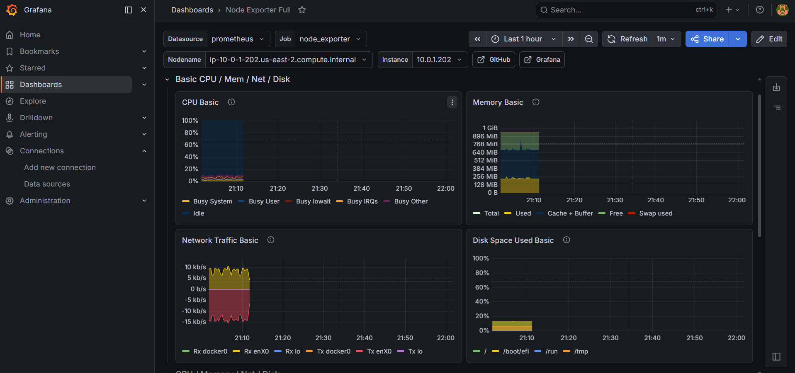

# AWS Chaos Engineering Auto-Recovery Cluster

A multi-AZ, self-healing web cluster on AWS, provisioned with Terraform and monitored with Prometheus + Grafana. A custom chaos engineering tool injects instance failures and measures how fast the system recovers.

The goal of this project was not just to *build* resilient infrastructure, but to **prove** it heals — by breaking it on purpose and measuring the recovery time.

**Result:** across 5 chaos trials, the cluster recovered automatically every time, with a mean Recovery Time Objective (RTO) of **93 seconds** and **zero full-service downtime**.

---

## Architecture

```
                          Internet
                             │
                    ┌────────▼────────┐
                    │  Application     │
                    │  Load Balancer   │   (health checks /health)
                    └────────┬────────┘
              ┌──────────────┴──────────────┐
        ┌─────▼─────┐                  ┌─────▼─────┐
        │   AZ-a    │                  │   AZ-b    │
        │  EC2 app  │                  │  EC2 app  │   ← Auto Scaling Group
        │  /health  │                  │  /health  │     (min 1, desired 2, max 3)
        │  /metrics │                  │  /metrics │
        │  node_exp │                  │  node_exp │
        └─────┬─────┘                  └─────┬─────┘
              └──────────────┬──────────────┘
                    ┌────────▼────────┐
                    │  Monitoring EC2  │
                    │  Prometheus      │   (EC2 service discovery)
                    │  Grafana         │
                    └─────────────────┘
```

- **Multi-AZ:** application instances run across two Availability Zones for fault tolerance.
- **Auto Scaling Group:** maintains the desired instance count; replaces any instance that fails ALB health checks.
- **Application Load Balancer:** distributes traffic and continuously health-checks the `/health` endpoint.
- **Monitoring server:** a separate EC2 instance running Prometheus (with EC2 service discovery) and Grafana.

---

## Tech Stack

| Layer | Technology |
|---|---|
| Infrastructure as Code | Terraform |
| Cloud | AWS (VPC, EC2, ALB, ASG, IAM, Security Groups) |
| App server | Apache (`httpd`) on Amazon Linux 2023 |
| Metrics collection | Prometheus + Node Exporter |
| Visualization | Grafana |
| Chaos / automation | Python (boto3) |

---

## Repository Layout

```
.
├── terraform/
│   ├── vpc.tf            # VPC, subnets (2 AZs), internet gateway, routing
│   ├── security.tf       # Security groups (ALB, EC2, monitoring)
│   ├── compute.tf        # Launch template, ALB, target group, ASG
│   ├── monitoring.tf     # Prometheus + Grafana EC2 instance
│   ├── iam.tf            # IAM role for Prometheus EC2 service discovery
│   ├── variables.tf
│   ├── outputs.tf
│   └── providers.tf
└── chaos/
    └── chaos.py          # Chaos tool: kill an instance, measure RTO
```

---

## How It Works

### 1. Infrastructure (Terraform)

`terraform apply` provisions the full stack: a custom VPC with public subnets in two AZs, security groups, an IAM role, a launch template, an Application Load Balancer, a target group, and an Auto Scaling Group. App instances bootstrap via user data — installing Apache, serving a `/health` endpoint (used by the ALB) and a `/metrics` endpoint, and running Node Exporter for Prometheus.

### 2. Observability (Prometheus + Grafana)

The monitoring instance runs Prometheus and Grafana in Docker. Prometheus uses **EC2 service discovery** (via an IAM role) to automatically find and scrape every instance tagged `Role=app` — no hardcoded IPs, so it keeps working as instances are replaced. It scrapes Node Exporter (port 9100) and the app `/metrics` endpoint (port 80) on a 15-second interval. Grafana visualizes CPU, memory, network, and disk across the fleet.



### 3. Chaos + Recovery Measurement (`chaos.py`)

The chaos tool:

1. Snapshots which instances are currently `healthy` in the ALB target group.
2. Terminates one at random (via the ASG, without decrementing desired capacity, so a replacement is forced).
3. Polls target-group health every 10 seconds, logging a live timeline of every instance's state.
4. Detects recovery — a *new* instance reaching `healthy` and the healthy count returning to baseline — and reports the RTO.

---

## Running It

### Prerequisites

- An AWS account with credentials configured (`aws configure`)
- Terraform installed
- Python 3 with `boto3` (`pip install boto3`)
- An EC2 key pair named `chaos-key` in the target region

### Deploy

```bash
cd terraform
terraform init
terraform apply
```

After apply, Terraform outputs the ALB URL and the monitoring server IP:

```bash
terraform output alb_dns_name      # open in a browser → app
terraform output monitoring_ip     # :9090 Prometheus, :3000 Grafana
```

### Run a chaos experiment

```bash
cd chaos
python chaos.py --dry-run          # safe: shows the target, kills nothing
python chaos.py                    # one experiment, measures RTO
python chaos.py --trials 5         # five experiments, reports mean RTO
```

### Tear down

```bash
cd terraform
terraform destroy
```

---

## Results

Five consecutive chaos trials, each terminating a random healthy instance:

| Trial | RTO |
|------:|----:|
| 1 | 80.8s |
| 2 | 80.7s |
| 3 | 111.0s |
| 4 | 80.7s |
| 5 | 111.0s |

```
Successful recoveries: 5/5
Mean RTO:  92.8s
Best RTO:  80.7s
Worst RTO: 111.0s
```

Throughout every trial, **at least one instance stayed healthy at every poll** — the service never went fully down.

**On the two-value spread:** recoveries clustered around ~81s and ~111s. The ~30s difference comes from ALB health-check timing — a newly-booted instance's first health check either lands within the current 30-second check window or waits for the next one, depending on timing relative to the ALB's cycle. The variance is health-check alignment, not instance boot time.

---

## Stuff that broke (and how I found it)

This didn't work on the first try. Or the fifth. Here are the ones worth remembering:

**Every instance was unhealthy and I had no idea why.** The ALB kept marking targets unhealthy and the ASG kept cycling them. I spent way too long assuming it was a security group or health-check config problem. It wasn't. I finally pulled the EC2 console output (`aws ec2 get-console-output`) and found the actual cause buried in the boot log: `dnf install curl` was failing with a package conflict, because Amazon Linux 2023 already ships `curl-minimal`. And because my user-data script had `set -e`, that one failed command killed the whole script before Apache ever got installed — so the instances looked provisioned but were serving nothing. Fix was one line: stop trying to install `curl`, it's already there.

**Prometheus refused to scrape my /metrics endpoint.** Targets showed up but stayed down with `non-compliant scrape target sending blank Content-Type`. Turns out Prometheus 3.x is strict about this — Apache was serving my static metrics file with no Content-Type header and Prometheus just rejected it. Added `fallback_scrape_protocol: PrometheusText0.0.4` to the scrape job and it was fine.

**Grafana couldn't talk to Prometheus even though both were up.** Kept getting connection refused on `localhost:9090`. Eventually realized they're on different Docker network modes — Prometheus runs with `--network host`, Grafana's on a bridge network, so `localhost` inside the Grafana container isn't the host. Pointed Grafana at the private IP instead and it connected.

The curl one was the worst, because nothing in the AWS console told me the script had died — everything *looked* provisioned. The boot log was the only place the truth showed up. Takeaway: when an instance is mysteriously unhealthy, read the console output before touching anything else.

---

## Possible Improvements

- Pre-baked AMI (Packer) to eliminate boot-time package installs and reduce RTO.
- Grafana provisioning (data source + dashboard as config) so the monitoring stack is fully reproducible.
- Remote Terraform state (S3 + DynamoDB locking).
- CI/CD pipeline running `terraform plan` on pull requests.
- HTTPS via ACM, and additional chaos failure modes (CPU stress, network latency).